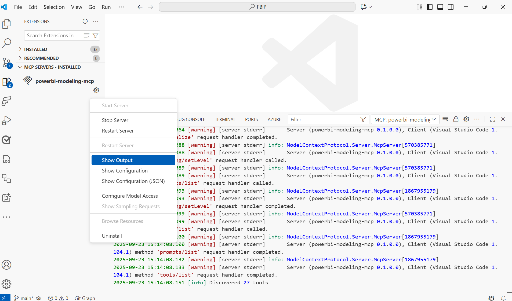

# Troubleshooting

This guide helps you diagnose and resolve common issues with the Power BI Modeling MCP Server. 

## Logging and Diagnostics

### Logging

The Power BI Modeling MCP Server is instrumented using the .NET [EventSource](https://learn.microsoft.com/dotnet/api/system.diagnostics.tracing.eventsource) to emit detailed information. Logging follows the pattern of marking operation start, completion, and exceptions. These logs are invaluable for diagnosing MCP Server issues.

Server logs can be obtained by capturing events for provider "Microsoft-Extensions-Logging".

#### Collecting logs with VS Code

By default, VS Code logs informational, warning, and error level messages. To get detailed interaction information:

1. Open Command Palette (Ctrl+Shift+P)
2. Search for "MCP: List Servers"
3. Select "Power BI Modeling MCP Server"
4. Select "Show Output"
5. Examine the "Output" window in VS Code
6. Select "MCP: Power BI Modeling MCP Server" from the dropdown menu



## Locating MCP Server Binaries in VS Code

The Power BI Modeling MCP Server extension installs its platform-specific binaries in the user profile directory under:

`%USERPROFILE%/.vscode/extensions/microsoft.powerbi-modeling-mcp-<version>-<platform>/server`
```

This can be useful for:
- Verifying the exact version installed
- Checking platform-specific binaries
- Finding the MCP binary to use from other MCP client tools
- Troubleshooting and replacing binaries in development builds