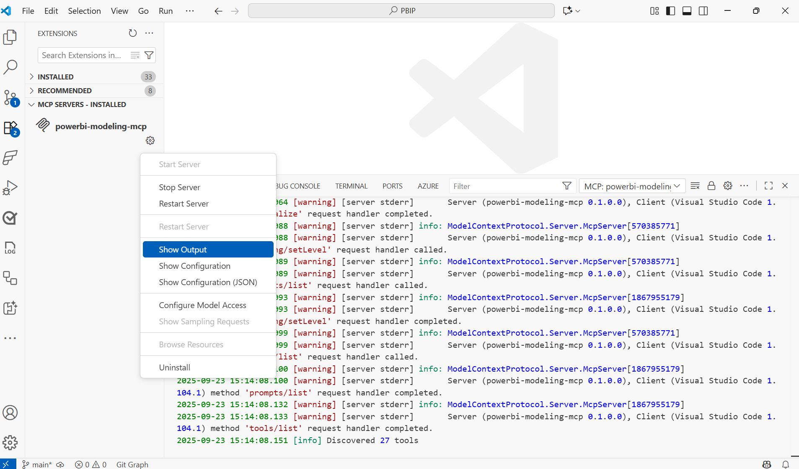
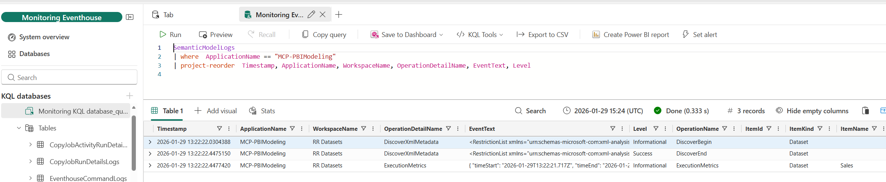

# Troubleshooting

This guide helps you diagnose and resolve common issues with the Power BI Modeling MCP Server. 

## MCP Server Logging

Check the [MCP server output log](https://code.visualstudio.com/docs/copilot/customization/mcp-servers#_mcp-output-log) for detailed information on any issues. These logs are essential for troubleshooting MCP Server problems.

1. Open Command Palette (Ctrl+Shift+P)
2. Search for **MCP: List Servers**
3. Select **powerbi-modeling-mcp**
4. Select **Show Output**
5. Examine the **Output** window in VS Code
6. Select **MCP: powerbi-modeling-mcp** from the dropdown menu

### Collect logs from EventSource

The Power BI Modeling MCP Server also uses the [.NET EventSource](https://learn.microsoft.com/dotnet/api/system.diagnostics.tracing.eventsource) to emit detailed information. You can capture these logs with tools such as [dotnet-trace](https://learn.microsoft.com/dotnet/core/diagnostics/dotnet-trace).

Capturing the MCP logs with **dotnet-trace**:

1. Install [dotnet-trace](https://learn.microsoft.com/dotnet/core/diagnostics/dotnet-trace)
2. Find the process ID for the server `powerbi-modeling-mcp.exe`
3. Run: `dotnet-trace collect -p {your-process-id} --providers 'Microsoft-Extensions-Logging:4:5'`
4. Collect the trace
5. A `.nettrace` file will be output

## Monitor MCP Activity in Fabric

All commands and queries issued by the MCP server are logged under the application name `MCP-PBIModeling`. You can track this activity using the [Fabric Workspace Monitor](https://learn.microsoft.com/en-us/fabric/fundamentals/workspace-monitoring-overview) by filtering events with `ApplicationName == "MCP-PBIModeling"`.

## Restart MCP Server

1. Open Command Palette (Ctrl+Shift+P)
2. Search for **MCP: List Servers**
3. Select **powerbi-modeling-mcp** Server
4. Select **Restart Server**
5. Examine the **Output** window in VS Code

## Locating MCP Server Binaries

The Power BI Modeling MCP Server extension installs its platform-specific binaries in the user profile directory under:

`%USERPROFILE%/.vscode/extensions/microsoft.powerbi-modeling-mcp-<version>-<platform>/server`

This can be useful for:
- Verifying the exact version installed
- Checking platform-specific binaries
- Finding the MCP binary to use from other MCP client tools
- Troubleshooting and replacing binaries in development builds

## Forcing Re-Authentication When Connecting to a Semantic Model in the Service

When you connect to a semantic model in a Fabric workspace, you are prompted to authenticate. That authentication is reused for the duration of the current session.

If you need to trigger the authentication prompt again (for example, to switch accounts), you must restart the MCP server. To do this, run: **MCP: List Servers** → **Restart Server**

This will reset the session and prompt you to authenticate again on the next connection.

## Frequently Asked Questions

**Question:** I’m unable to install the new version of the MCP server in Visual Studio Code. The installation hangs and never completes.

**Answer:** [Restart the MCP Server](#restart-mcp-server) and try again. If that doesn’t resolve the issue, restart Visual Studio Code.

