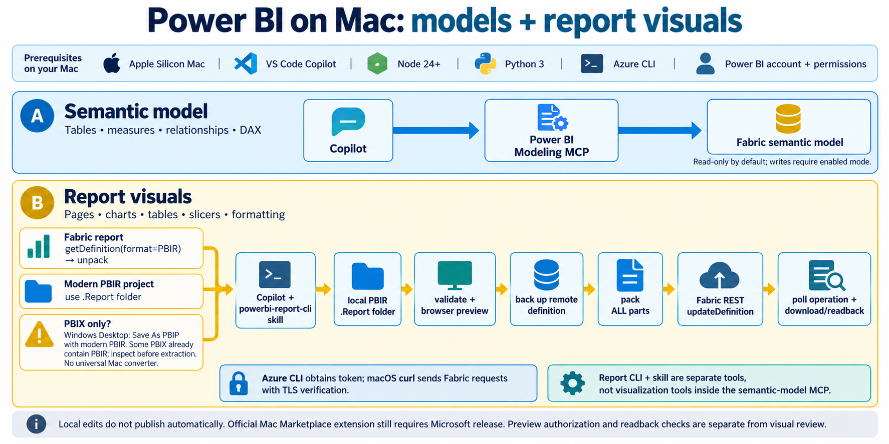
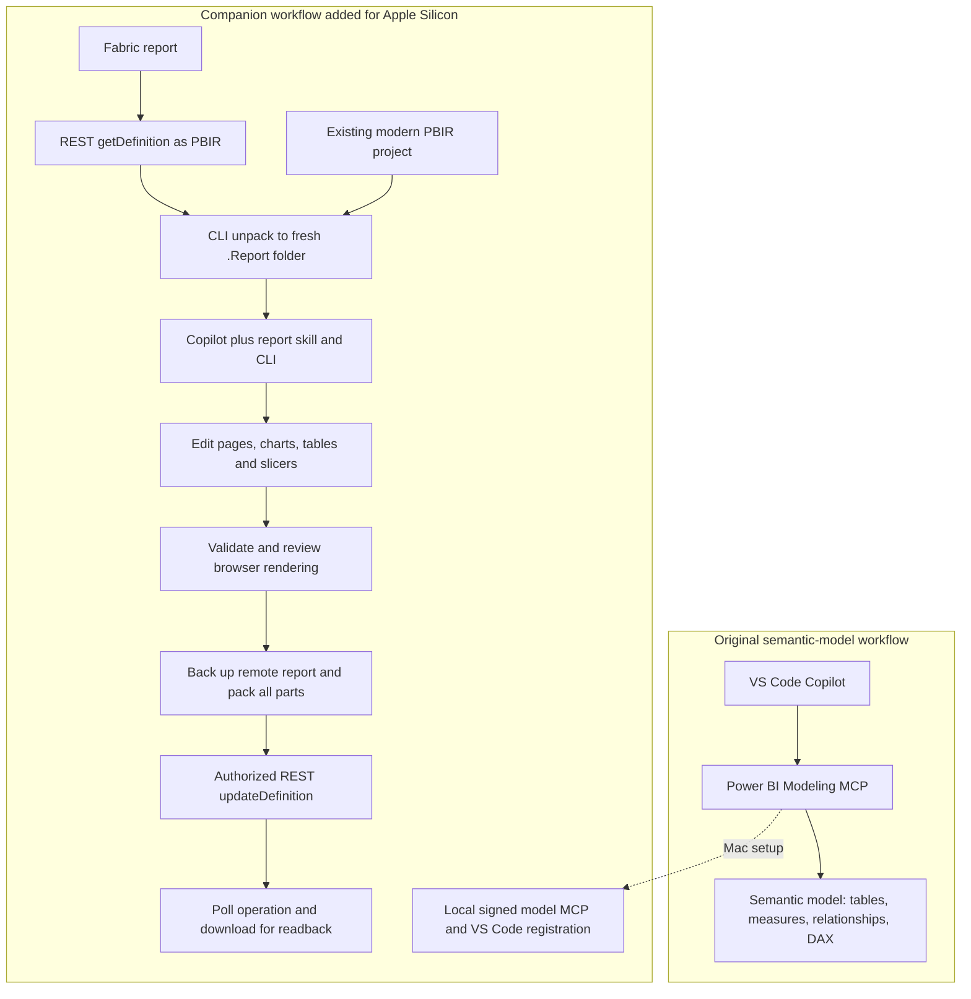

# Apple Silicon model and report authoring workflow

This contribution installs a **local companion workflow** for Microsoft Power BI
semantic-model authoring and report visualization authoring in VS Code Copilot.
It does not publish an official Mac extension or add report tools to Microsoft's
semantic-model MCP. Microsoft must still publish a supported Mac VSIX.

The installer uses the official npm packages, copies and locally ad-hoc signs the
ARM64 MCP executable, installs the official report-authoring CLI and skill, and
registers the model MCP in VS Code. It downloads no organization-specific data.
No Microsoft EULA is accepted automatically; no models or reports are modified.

## Install

Requirements: native Apple Silicon macOS, Python 3, Node.js 24 or later, npm, Git,
and `codesign` (Apple developer tools). Azure CLI and an appropriate Power BI
account are also needed when connecting to Fabric or previewing live data.

From a checkout of this contribution:

```bash
python3 scripts/macos_setup.py
```

Setup defaults to read-only semantic-model access. For model authoring, explicitly
select write mode; write confirmation remains enabled:

```bash
python3 scripts/macos_setup.py --model-mode read-write --replace-existing
```

The pinned, tested dependencies are MCP 1.0.0, report CLI 0.4.0, and the skill
repository commit recorded in `scripts/macos_setup.py`. These pins make this
workaround reproducible; later vendor releases need separate testing. The
installer refuses unexpected patch contexts and conflicting skill directories.
If the skill already exists, retain your installation or choose a separate
`--skill-directory`; it is never silently overwritten.

Setup adds only the `powerbi-macos` entry to your VS Code user MCP config, backs
up existing JSON first, and preserves all other servers. A conflicting entry
requires `--replace-existing`. For JSONC configurations, choose a separate
`--config .vscode/mcp.json` file rather than losing comments. Files with comments
are rejected, not rewritten.

The installed report wrapper is under the chosen prefix's `bin` directory. Start
VS Code from a terminal with that directory on PATH so the report skill finds it:

```bash
export PATH="$HOME/Library/Application Support/powerbi-macos/bin:$PATH"
code /path/to/your/report/project
```

Reload VS Code, start `powerbi-macos` from **MCP: List Servers**, and enable its
tools in Copilot Agent mode. Review the [Microsoft EULA](https://github.com/microsoft/powerbi-modeling-mcp/blob/main/EULA.txt)
and explicitly authorize `accept_eula` if you agree. Then connect to a test model
and list tables and measures. Use read/write mode only when model changes are
intended.

For pages, charts, slicers, formatting, and themes, ask Copilot to use the
`powerbi-report-cli` skill against a local PBIR/PBIP report. The CLI provides
visual metadata and validation; the skill authors the report definitions.
Report changes remain local until you explicitly request publishing.

## Fixes included

- **Unsigned ARM64 MCP:** sign a separate local copy, keeping its resources,
  then run MCP initialization and tool-discovery checks. The direct executable
  avoids the npm launcher's signal-kill-as-success behavior. This is local
  ad-hoc signing, not Developer ID signing or notarization for distribution.
- **Missing report tooling:** install report CLI, its matching skill, and
  Chromium for service preview. Keep a pinned full skill checkout so relative
  shared references continue to resolve.
- **Personal workspace preview:** apply a guarded patch to both report CLI
  entry points. Retry the My Workspace dataset API only when the group API
  explicitly reports `GroupNotAccessible` for a personal workspace. Generic
  401/403 errors are preserved; no permissions are bypassed.
- **Node certificate trust:** the report wrapper uses Node's `--use-system-ca`
  option. TLS verification remains enabled.
- **Token-spawn warning:** invoke Azure CLI without a shell on macOS, avoiding
  Node's `DEP0190` warning. Windows retains its command-shim handling.
- **Windows-only screenshot instructions:** create a separate skill copy with
  the same shared-reference layout and a resolved macOS application-data parent.
  Preserve the screenshot approval, temporary-directory, review, and cleanup
  workflow. The original pinned Git checkout remains unchanged.
- **Azure CLI HTTP certificate compatibility:** `scripts/fabric_request.py`
  acquires a Fabric token through Azure CLI and uses macOS curl to send the
  request with TLS verification. The bearer token stays in process memory and
  stdin, not files, command arguments, or output. Only the Fabric HTTPS host
  is accepted; redirects are not followed. Mutating calls require
  `--allow-write`.

## Which tools do users need?

| Component | Purpose | Required when |
| --- | --- | --- |
| VS Code Copilot Agent | Runs the workflow from your instructions | Using this Copilot workflow |
| Power BI Modeling MCP | Connects to semantic models; inspects tables, measures and relationships; performs permitted model/DAX operations | Reading or changing the semantic model |
| `powerbi-report-cli` skill + `powerbi-report-author` CLI | Inspects, edits, validates, previews and packages modern PBIR report definitions | Editing pages and visuals |
| Azure CLI | Obtains the signed-in user's Fabric/Power BI access token | Accessing service reports or live preview |
| Fabric REST + macOS curl transport | Downloads, backs up and updates report definitions | Moving reports between the Mac and Fabric |
| Chromium | Renders the CLI's browser preview | Checking actual visual output |

The report CLI and skill are **not an additional MCP server**. The semantic-model
MCP does not acquire report-page editing tools through this installer. A separate
Fabric MCP is optional; this workflow uses REST for report-definition operations.
The installer requires Apple Silicon macOS, Python 3, Node 24+, npm, Git and
`codesign`. Users supply Azure CLI, sign-in and workspace/model permissions.

## Prepare an editable report: PBIX, PBIP and PBIR

Downloading a `.pbix` does not make it directly editable by this report workflow.
PBIX is a packaged file; PBIP is a project; modern PBIR is the report definition
stored as editable files in a `.Report` folder. `definition.pbir` describes the
model binding; `definition/` contains pages and visuals. A `definition.pbir` file
alone does not prove that the report uses modern PBIR.

Choose the path matching the input:

1. **Published Fabric report (preferred on Mac):** request
   `getDefinition?format=PBIR`, complete any long-running operation, save the
   final response body and unpack it into a fresh folder:

   ```bash
   powerbi-report-author unpack ./MyReport.Report --input downloaded-definition.json
   ```

   This decodes the service definition into files; it does not download or convert
   the model's data. If the service returns PBIR-Legacy, stop: the CLI does not
   convert that format into modern PBIR.

2. **Existing modern PBIR/PBIP project:** use its `.Report` folder directly.
   Preserve its model binding and resource files; no download is necessary.

3. **Only a PBIX file:** use Windows Power BI Desktop to open it and Save As a
   PBIP project using modern PBIR, then transfer the project to the Mac. See
   [Microsoft's PBIP instructions](https://learn.microsoft.com/en-us/power-bi/developer/projects/projects-overview)
   and [report-format documentation](https://learn.microsoft.com/en-us/power-bi/developer/projects/projects-report).
   Some PBIX files already contain modern PBIR; an inspected copy can provide
   report files, but that is file-specific extraction, not a universal conversion.
   This contribution does not include a general Mac PBIX converter or a tool to
   rebuild an edited PBIX container. Renaming `.pbix` to `.pbip` does not convert it.

Keep the original file unchanged. Before editing, verify modern PBIR structure,
schemas, resource completeness and the intended semantic-model binding. Inspect
model field types before choosing chart axes or date hierarchies. A text date
field cannot be treated as an existing model date hierarchy.

### What the original MCP provided, and what this contribution adds



Lane A shows the semantic-model capability already provided by the MCP. Lane B
shows the separate report-authoring path assembled by this companion workflow.
The Mac installer prepares the tools; it does not automatically download,
convert, edit or publish a user's report.



### Worked example from the user's report

The downloaded PBIX in this session already contained a modern PBIR report
definition. Its report files were extracted into a local `.Report` folder and
bound to the existing Fabric semantic model; the original PBIX remained unchanged.
That local preparation did not create a complete Desktop project or convert the
embedded model. The subsequent workflow preserved the original page and added a
Monthly Progress page with a title, column chart, detail table and four slicers.

Model inspection found that the target-end field was text. The chart therefore
used Modified Year/Month and current WIP Status: it represents modification
activity, not historical status or completion progress.

The user reported backing up the remote definition, uploading the complete
report and verifying all 17 expected parts through readback. Their preview
authorization error left that page's live rendering unverified. These are
user-reported report-operation results, separate from the contribution's own
installer/transport tests recorded below; those tests did not upload this report
or visually review all its pages.

## Report download and upload

Use the report skill's management workflow for target resolution, complete
definitions, backup, bindings, long-running operations, and readback verification.
If Azure CLI's HTTP transport fails certificate checks while curl works, the
included transport helper can be used for the same Fabric endpoints:

```bash
python3 scripts/fabric_request.py \
  "https://api.fabric.microsoft.com/v1/workspaces/WORKSPACE_ID/reports/REPORT_ID/getDefinition?format=PBIR" \
  --method POST --out download-response.json --body-out downloaded-definition.json
```

The output includes status and operation headers. A `202` body is not a completed
definition: poll the returned operation URL until `Succeeded`, then request its
`/result` endpoint and save that completed body before `unpack --input`.

Back up the **completed current remote definition** before an overwrite. Validate
the full local report and check live rendering before publishing whenever possible.
Never describe skipped schema downloads or unverified rendering as passed tests.
Use `powerbi-report-author pack <report-folder> --raw --out update-definition.json`
to include all report parts. Sending only changed parts deletes omitted content.

Only after explicit approval to overwrite the identified report:

```bash
python3 scripts/fabric_request.py \
  "https://api.fabric.microsoft.com/v1/workspaces/WORKSPACE_ID/reports/REPORT_ID/updateDefinition" \
  --method POST --body update-definition.json --allow-write --out upload-response.json
```

If this returns `202`, poll its operation to completion; do not resubmit the
upload. Download the updated definition again and compare the affected pages and
visuals before reporting success. The helper is deliberately a transport tool,
not an automatic publication shortcut.

## Test before contributing

Offline regression suite (Node must be available for JavaScript tests):

```bash
python3 -m unittest discover -s tests -v
```

Installer integration test with an isolated prefix and separate config/skill:

```bash
python3 scripts/macos_setup.py \
  --prefix "$HOME/Library/Application Support/powerbi-macos-test" \
  --config "$HOME/Library/Application Support/powerbi-macos-test/mcp.json" \
  --skill-directory "$HOME/Library/Application Support/powerbi-macos-test/report-skill"
```

For live checks, use a test workspace and record separately: model connection,
read-only DAX, report schema checks, browser startup, actual rendered pages, and
explicitly approved report upload/readback. Installer startup checks do not
establish live tenant permissions or prove every visual renders correctly.

The installer is tested only on Apple Silicon, not Intel Macs or Windows VMs.
Power BI Desktop operations still require Windows. This contribution does not
claim to resolve all upstream issues or provide a Marketplace release.

### Recorded validation, 2026-10-02

Environment: macOS 26.6.2 ARM64, Node.js 24.11.1, Python 3.14.0.

| Check | Result |
| --- | --- |
| Offline regression tests | 18 passed |
| Isolated installer, including repeated installation | Passed |
| Signed semantic-model MCP initialize and tools/list | Passed; model and connection tools discovered |
| Report CLI doctor and visual metadata provider | Passed; 57 visual types |
| Chromium startup with a fresh temporary profile | Passed |
| Authenticated service preview, including My Workspace fallback | Returned `ok: true` |
| Certificate-safe helper reading a Fabric report | HTTP 200 |
| Live screenshot review of every visual | Not performed in this contribution test |
| Report upload through the new transport helper | Not performed; no remote writes in contribution tests |
| Clean-Mac installation and Intel Mac support | Not tested |

These results substantiate the tested fixes, not a promise that every report,
tenant policy, corporate certificate configuration, or Mac installation works.
